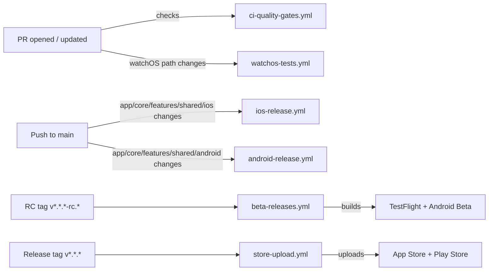

# CI/CD Pipeline & Quality Gates

_Last updated: 2026-04-16_

This document describes the current GitHub Actions and Fastlane CI/CD pipeline for the myLoyaltyCards repository. It is the single source of truth for how builds, tests, tags, and deploys run across iOS, Android, and watchOS.

## Table of Contents

- [Pipeline at a Glance](#pipeline-at-a-glance)
- [Workflow Details](#workflow-details)
  - [Quality Gates](#quality-gates)
  - [watchOS Tests](#watchos-tests)
  - [iOS AdHoc Build](#ios-adhoc-build)
  - [Android AdHoc Build](#android-adhoc-build)
  - [Beta Releases (RC)](#beta-releases-rc)
  - [Store Upload (Final Release)](#store-upload-final-release)
- [Fastlane & Native Build Notes](#fastlane--native-build-notes)
- [Release Runbooks](#release-runbooks)
  - [Ship to TestFlight](#ship-to-testflight)
  - [Release to Production](#release-to-production)
  - [Manual / AdHoc Build](#manual--adhoc-build)
- [watchOS CI/CD](#watchos-ci-cd)
- [Provisioning & match](#provisioning--match)
- [Troubleshooting](#troubleshooting)
- [References](#references)

## Pipeline at a Glance



### Workflow names

- `.github/workflows/ci-quality-gates.yml`
- `.github/workflows/watchos-tests.yml`
- `.github/workflows/ios-release.yml`
- `.github/workflows/android-release.yml`
- `.github/workflows/beta-releases.yml`
- `.github/workflows/store-upload.yml`

## Workflow Details

### Quality Gates

File: `.github/workflows/ci-quality-gates.yml`

Triggers:

- `pull_request` on opened, synchronize, reopened, ready_for_review
- `push` to `main`

What it runs:

- `yarn install --frozen-lockfile`
- `yarn lint`
- `yarn typecheck`
- `yarn test:coverage --watchAll=false --runInBand`
- uploads the coverage report as an artifact

Notes:

- GitHub status checks are the primary notification mechanism.
- Slack notification is optional and only sent when `SLACK_WEBHOOK_URL` is configured.
- No email notifications are configured in the workflow.

### watchOS Tests

File: `.github/workflows/watchos-tests.yml`

Triggers:

- `pull_request` on opened, synchronize, reopened, ready_for_review
- `push` to `main`

Path filters:

- `targets/watch/**`
- `watch-ios/**`
- `ios/**`
- `app.json`
- `fastlane/Fastfile`

What it runs:

- `yarn install --frozen-lockfile`
- Jest tests for `targets/watch/__tests__`
- `npx expo prebuild --clean --platform ios`
- `xcrun --sdk macosx swift watch-ios/Scripts/generate-catalogue.swift`
- `yarn watch:build:ci`

Purpose:

- Verifies the watchOS companion target builds on macOS.
- Ensures watch target signing and generated catalogue code remain valid.

### iOS AdHoc Build

File: `.github/workflows/ios-release.yml`

Triggers:

- `push` to `main` when any of these paths change:
  - `app/**`
  - `core/**`
  - `features/**`
  - `shared/**`
  - `ios/**`
- `workflow_dispatch` for manual runs on any branch

What it runs:

- `yarn install --frozen-lockfile`
- `npx expo prebuild --platform ios`
- `xcrun --sdk macosx swift watch-ios/Scripts/generate-catalogue.swift`
- `bundle exec fastlane ios adhoc`

Output:

- `output/*.ipa` uploaded as a workflow artifact

### Android AdHoc Build

File: `.github/workflows/android-release.yml`

Triggers:

- `push` to `main` when any of these paths change:
  - `app/**`
  - `core/**`
  - `features/**`
  - `shared/**`
  - `android/**`
- `workflow_dispatch` for manual runs on any branch

What it runs:

- `yarn install --frozen-lockfile`
- `npx expo prebuild --platform android`
- `bundle exec fastlane android adhoc`

Output:

- `android/app/build/outputs/apk/release/*.apk` uploaded as a workflow artifact

### Beta Releases (RC)

File: `.github/workflows/beta-releases.yml`

Triggers:

- `push` tags matching `v*.*.*-rc.*`

Jobs:

- `ios-testflight-beta` builds and uploads the iOS app to TestFlight using `bundle exec fastlane ios beta`
- `android-beta` builds the Android beta artifact using `bundle exec fastlane android beta`; it does not currently upload to Play Console.

Notes:

- The iOS job runs `npx expo prebuild --platform ios` and generates the watchOS catalogue before Fastlane.
- There is no separate `watch_beta` lane; the watch companion is included in the iOS `beta` lane.

### Store Upload (Final Release)

File: `.github/workflows/store-upload.yml`

Triggers:

- `push` tags matching `v*.*.*`
- excludes pre-release tags via `!v*.*.*-*`

Jobs:

- `upload-ios-release` runs `bundle exec fastlane ios upload_release`
- `upload-android-release` runs `bundle exec fastlane android upload_release`

Notes:

- The iOS release job includes the watchOS companion app build and signing as part of the same lane.
- This workflow uploads to App Store Connect and Play Store production.

## Fastlane & Native Build Notes

Location:

- `fastlane/Fastfile`
- `fastlane/Appfile`
- `fastlane/Matchfile`

Important details:

- `setup_ci` runs automatically in iOS lanes on CI to create a temporary keychain for `match`.
- `npx expo prebuild` is required before iOS and Android Fastlane lanes to generate native projects.
- iOS signing is handled with `fastlane match` and `update_code_signing_settings` for both:
  - main iOS bundle ID
  - watchOS bundle ID (`#{app_identifier}.watch`)
- The watch app is built together with the iOS app in the same `ios` lane, not by a separate lane.

iOS lanes summary:

- `ios adhoc` — AdHoc distribution build
- `ios beta` — TestFlight upload
- `ios upload_release` — App Store release upload

Android lanes summary:

- `android adhoc` — Release APK build
- `android beta` — Android beta artifact build (no Play Store upload in the current lane)
- `android upload_release` — Play Store production upload

## Release Runbooks

### Ship to TestFlight

1. Confirm `main` is green with passing CI.
2. Decide the release version.
3. Create an RC tag:

```bash
git tag v1.0.0-rc.1
git push --tags
```

4. Monitor `.github/workflows/beta-releases.yml` in GitHub Actions.
5. Verify the iOS build appears in App Store Connect → TestFlight.
6. Verify Android beta appears in Play Console beta.
7. Distribute to testers.

### Release to Production

1. Validate the RC/TestFlight build.
2. Create a final release tag:

```bash
git tag v1.0.0
git push --tags
```

3. Monitor `.github/workflows/store-upload.yml` in GitHub Actions.
4. After upload completes, submit the build for App Store / Play Store review.

### Manual / AdHoc Build

Manual workflow:

- Open the GitHub Actions UI.
- Trigger `.github/workflows/ios-release.yml` or `.github/workflows/android-release.yml` via `workflow_dispatch`.

Local adhoc build:

```bash
bundle exec fastlane ios adhoc
bundle exec fastlane android adhoc
```

## watchOS CI/CD

The watchOS companion app is part of the iOS build pipeline.

Key points:

- `watchos-tests.yml` verifies watch target compilation and catalogue generation on macOS.
- It is a build verification path, not a full signed release validation.
- `beta-releases.yml` and `store-upload.yml` build the watch app as part of the same iOS lane.
- The watch app uses a separate watch bundle ID and provisioning profile managed by `match`.

watchOS signing path:

- `match(type: 'adhoc', app_identifier: watch_identifier, readonly: is_ci)` for AdHoc builds
- `match(type: 'appstore', app_identifier: watch_identifier, readonly: is_ci)` for beta/release uploads
- `update_code_signing_settings` targets the watch target explicitly

Note:

- There is no dedicated `watch_beta` or `watch_upload_release` lane in the current Fastfile.
- The watch companion is signed and built inside the iOS `beta` and `upload_release` lanes.

## Provisioning & match

fastlane match behavior:

- `match` is configured in `fastlane/Matchfile` and uses the certificate repository referenced there.
- CI runs `match` in readonly mode via `readonly: is_ci`.
- Local runs may use write mode if the developer has access to the certificate repo and the correct secrets.
- The iOS `fastlane` lanes call `setup_ci` on macOS CI runners to create a temporary keychain before `match` runs.

CI environment variables used for `match` and signing:

- `MATCH_PASSWORD`
- `MATCH_GIT_BASIC_AUTHORIZATION`
- `MATCH_USERNAME`
- `FASTLANE_TEAM_ID`
- `APP_STORE_CONNECT_API_KEY_KEY_ID`
- `APP_STORE_CONNECT_API_KEY_ISSUER_ID`
- `APP_STORE_CONNECT_API_KEY_KEY`

For Android uploads, the CI secrets are:

- `ANDROID_PACKAGE_NAME`
- `PLAY_STORE_API_KEY`
- `EXPO_PUBLIC_SUPABASE_URL`
- `EXPO_PUBLIC_SUPABASE_KEY`

Adding a new bundle ID in this repo:

1. Register the new app identifier in Apple Developer.
2. Create the app record in App Store Connect if needed.
3. Add the identifier to `fastlane/Matchfile` if the repo configuration is restrictive.
4. Run locally:

```bash
bundle exec fastlane ios fetch_certificates
```

5. Confirm the new provisioning profile is committed to the certificate repository.

Project-specific notes:

- `fastlane/Appfile` defines the base iOS app identifier used by the Fastlane lanes.
- `fastlane/Matchfile` defines how `match` connects to the certificate repository and which app identifiers are synced.
- The watch bundle ID is derived from the base iOS app identifier as `#{app_identifier}.watch`.

CI keychain setup:

- `setup_ci` creates a temporary keychain on macOS CI runners.
- This temporary keychain is required before `match` can install certificates.
- It is enabled automatically in iOS lanes when `is_ci` is true.

## Troubleshooting

### Fastlane fails immediately (~1 second)

- Check GitHub Actions secrets.
- Verify `MATCH_PASSWORD`, App Store Connect API secrets, and platform-specific secrets are present.
- Confirm `SLACK_WEBHOOK_URL` is not causing unexpected failure in the quality gates workflow.

### Code signing error

- Check the app identifier and watch bundle ID in `fastlane/Appfile`.
- Verify `match` profile names match the bundle IDs.
- Confirm the correct Xcode project and target names are passed to `update_code_signing_settings`.

### Build number conflict

- iOS `beta` lane uses the last TestFlight build number and increments it.
- `adhoc` and `upload_release` use `GITHUB_RUN_NUMBER` on CI or a timestamp locally.
- Android beta/release lanes use the next Play Console version code.

### `expo prebuild` changes signing settings

- Always run `npx expo prebuild` in the workflow before Fastlane.
- watchOS and iOS native project generation must happen before `build_app`.

### watchOS build uses wrong destination

- Verify the watch target is still named `watch` in `update_code_signing_settings`.
- Confirm `watch-ios/Scripts/generate-catalogue.swift` runs successfully before the Xcode build.

## References

- `docs/sprint-artifacts/stories/11-6-watchos-testflight-pipeline.md`
- `docs/sprint-artifacts/stories/11-2-build-on-main-app-changes-only.md`
- `docs/sprint-artifacts/epic-11-cicd.yaml`
- `fastlane/Fastfile`
- `.github/workflows/ci-quality-gates.yml`
- `.github/workflows/watchos-tests.yml`
- `.github/workflows/ios-release.yml`
- `.github/workflows/android-release.yml`
- `.github/workflows/beta-releases.yml`
- `.github/workflows/store-upload.yml`
