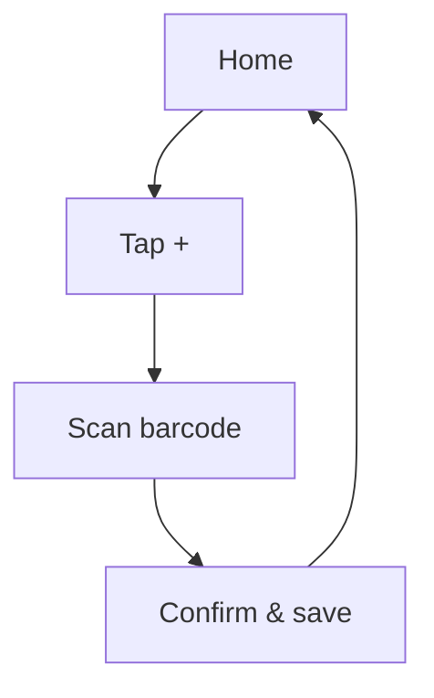

# Flows

User and screen flows as **Mermaid-in-markdown**. Author each flow as a `.md` file with a
fenced `mermaid` block so it renders natively on GitHub and diffs as plain text.

Example:

````markdown
# Add-card flow


````

See [`../CONTRIBUTING-DESIGN.md`](../CONTRIBUTING-DESIGN.md) for the contribution workflow.
