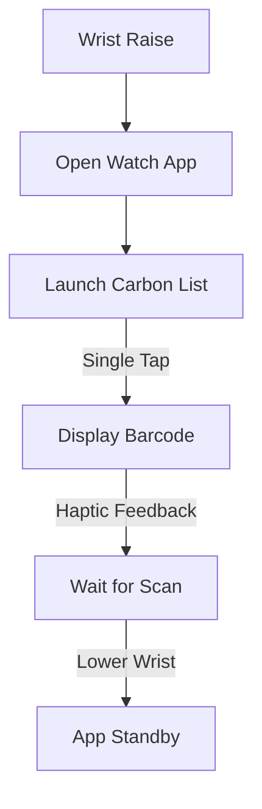
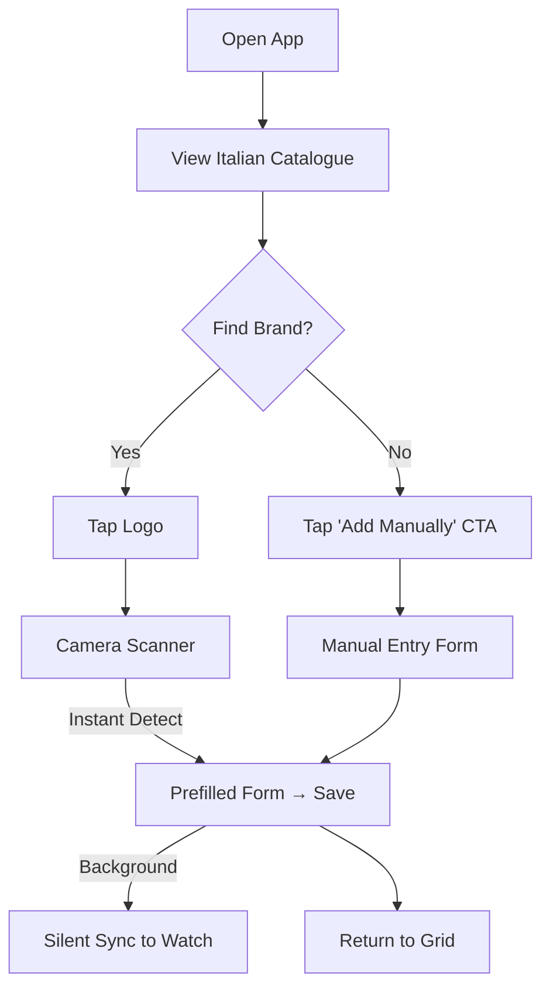

# UX Design Specification myLoyaltyCards

**Author:** Ifero
**Date:** 2025-12-22

---

<!-- UX design content will be appended sequentially through collaborative workflow steps -->

## Executive Summary

### Project Vision

**myLoyaltyCards** is a speed-obsessed, offline-first loyalty card manager designed to eliminate checkout friction. By prioritizing standalone wearable independence and a sub-3-second display goal, it transforms a multi-step phone search into a single-tap wrist interaction. It is built on the philosophy that "fast is better than feature-rich," providing a universal home for any barcode, QR code, or numeric loyalty ID.

### Target Users

- **The Time-Sensitive Shopper:** Users who value efficiency and want a sub-3-second display on their wrist.
- **The Universal Collector:** Users with diverse cards, from Italian national brands to local custom tags.
- **The Pragmatic Tech-User:** Users who want a "straight-forward," scan-and-go experience.

### Key Design Challenges

- **Sub-3-Second Access:** A UI hierarchy that surfaces the right card instantly.
- **Universal Input:** Handling catalogue brands and custom "wildcard" entries with equal speed.
- **Cross-Platform Legibility:** High-contrast barcode rendering across all watch and phone screens.

### Design Opportunities

- **Extreme Minimalism:** An "instant-on" utility feel.
- **Custom Card Personalization:** Users can name cards (up to 20 characters) and pick from a 5-color palette (Blue, Red, Green, Orange, Grey) to create instant visual recognition on the watch without complex image syncing.
- **Intelligent Sorting:** Using recency and pinning to anticipate user needs.

## Core User Experience

### Defining Experience

The core experience is defined by **Zero-Latency Readiness**. The transition from a closed app to a scannable barcode must be instantaneous. On the watch, this is achieved through vertical scrolling of high-contrast cards. On the phone, a responsive grid (2-3 columns) allows for quick scanning of a larger library.

### Platform Strategy

- **Watch (watchOS/Wear OS):** Vertical list navigation optimized for the Digital Crown/Touch. Tapping a card displays the barcode immediately with NO confirmation screen.
- **Phone (iOS/Android):** Responsive grid management console. Tapping a card reveals the barcode, with card settings and details accessible directly below the displayed code for effortless management.
- **Security:** Optional Biometric/PIN lock available in settings (**Post-MVP**; excluded from onboarding to minimize friction).

### Effortless Interactions

- **The "One-Tap" Barcode:** Eliminating confirmation dialogs to save critical seconds at the register.
- **Responsive Dashboard:** Automatic column adjustment based on device width (2 columns on smaller phones, 3 on larger Pro/Max models).
- **System-Aware Theme:** Dark mode that respects system settings by default but allows for manual override.

### Critical Success Moments

- **The "Digital Crown Flick":** Finding a card at the bottom of a list of 10 in under 1 second using vertical scroll.
- **The "Silent Sync":** Adding a card on the phone and having it appear on the watch before the user even reaches the checkout.
- **The "Secure-Choice":** Users feeling in control by enabling biometrics only when _they_ decide it's necessary.

### Experience Principles

1.  **Speed Above All:** Every interaction is measured in milliseconds. No confirmations, no fluff.
2.  **Vertical Familiarity:** Using standard vertical scrolling patterns to ensure the UI "disappears" into the user's muscle memory.
3.  **Adaptive Utility:** Layouts that adapt to the device (columns on phone) to maximize the amount of information visible at a glance.
4.  **Frictionless Onboarding:** Getting the user to their first "Scan" as fast as possible by deferring non-essential settings like security.

## Desired Emotional Response

### Primary Emotional Goals

- **Ultra-Efficient & In Control:** Users should feel like "checkout ninjas"—completely organized and faster than the process around them.
- **Quiet Confidence:** The absolute trust that the app will work instantly, regardless of network connectivity or device status.

### Emotional Journey Mapping

- **First Discovery:** Curiosity and hope ("Could this really be faster?").
- **Core Action (At Register):** Relief and Empowerment. The barcode is there before the question is asked.
- **Post-Task:** Satisfaction and Pride. The subtle "I've optimized my life" feeling.
- **Repeat Use:** Deep Trust. The app becomes an invisible, reliable utility.

### Micro-Emotions

- **The "Aha!" of Speed:** That split-second of delight when the barcode appears without a loading spinner.
- **The "No-Signal" Smirk:** The feeling of superiority when the app works in a basement where others are struggling with their phones.
- **The "Beep" Success:** The high-five moment of a successful scanner read.

### Design Implications

- **Confidence through Performance:** Eliminating "Loading..." states to prevent user anxiety.
- **Pride through Polish:** High-contrast, native-feeling UI that looks premium on expensive hardware.
- **Relief through Simplicity:** Deferring complex settings (like biometrics) so the user doesn't feel overwhelmed during setup.

### Emotional Design Principles

- **Performance is Politeness:** Respecting the user's time is the highest form of emotional empathy in this context.
- **Predictability over Novelty:** Using standard patterns to reduce cognitive load and increase user confidence in high-pressure situations (like a long line).
- **Silent Reliability:** The app should never "beg" for attention; it should just be there when needed.

## UX Pattern Analysis & Inspiration

### Inspiring Products Analysis

- **Apple/Google Wallet:** The benchmark for 'Checkout Readiness.' They excel at high-contrast vertical stacking and hardware-trigger access. The 'Aha!' comes from the card appearing exactly when the hand reaches for the terminal.
- **Authenticator Apps (e.g., Google Authenticator):** These are 'Speed-to-Code' specialists. They handle high-stress situations by stripping away all brand flourishes in favor of massive, legible codes and zero navigation depth.
- **Transit Apps (e.g., Citymapper/Passes):** These prioritize 'Contextual Glanceability.' They succeed because they surface the single most important piece of information (the QR code or gate pass) in a high-pressure, mobile environment.

### Transferable UX Patterns

- **Navigation Patterns:** **The 'Infinite Vertical Stack'** (Apple Wallet style). It’s perfect for the watch's Digital Crown and allows users to 'flick' through 10+ cards in under a second.
- **Interaction Patterns:** **'Tap-to-Expand'** (Authenticator style). Instead of a detail page, tapping a list item simply scales the barcode to fill the screen instantly.
- **Visual Patterns:** **'OLED-First High Contrast'** (True black backgrounds). This saves battery on wearables and ensures the white barcode 'pops' for laser scanners at the register.

### Anti-Patterns to Avoid

- **Promotional Bloat:** Many loyalty apps try to show 'Rewards' or 'Ads' on the card screen. This creates visual noise that slows down the user's ability to find the barcode.
- **Horizontal Swiping for Lists:** Swiping left/right on a watch is much slower than vertical scrolling and often conflicts with system gestures.
- **The 'Loading...' State:** Relying on a network to fetch a barcode at the register is the ultimate anti-pattern for this project.

### Design Inspiration Strategy

- **What to Adopt:** The **Vertical Card Stack** for the watch and the **Immediate Barcode Display** (no detail screens).
- **What to Adapt:** The **Color Palette Logic** we discussed earlier—using 5 bold colors to make custom cards as recognizable as 'official' brand logos.
- **What to Avoid:** Any form of 'Store News' or 'Marketing' on the primary display. If it's not a barcode or a card name, it's in the way.

## Design System Foundation

### 1.1 Design System Choice

**Hybrid Native-First (NativeWind + Expo)**

- **Wearables (watchOS/Wear OS):** Native system patterns using platform-optimized components.
- **Mobile (iOS/Android):** **NativeWind (Tailwind CSS for React Native)** running on the **latest Expo SDK**.

### Rationale for Selection

- **Developer Velocity:** NativeWind allows for rapid UI iteration and handles the 2/3 column responsive logic with standard Tailwind utility classes.
- **Performance:** NativeWind v4 compiles styles to native code, ensuring zero runtime overhead for styling, which is critical for our speed goals.
- **Ecosystem:** The latest Expo SDK provides the most robust toolset for cross-platform development, including seamless watch app integration.
- **Maintainability:** A thin UI layer means less code to maintain and fewer external dependencies to manage over time.

### Implementation Approach

- **Watch:** Standard vertical lists optimized for the hardware's interaction model.
- **Phone:** A utility-first approach using NativeWind to build a clean, high-contrast dashboard that adapts to screen width.
- **Theming:** Centralized Tailwind configuration for the 5-color palette and OLED-black themes.

## 2. Core User Experience

### 2.1 Defining Experience

The **'Fumble-Free Flash'**. It’s the feeling of being faster than the checkout process itself. It’s not just about a list of cards; it’s about the _instant_ availability of the right barcode at the exact moment of transaction.

### 2.2 User Mental Model

Users aren't 'browsing' an app; they are performing a utility task under pressure. They currently associate loyalty cards with friction (searching, loading, fumbling). Their mental model for this app should be **'It's just there when I need it,'** much like checking the time or paying with a watch.

### 2.3 Success Criteria

1.  **The 3-Second Rule:** ≤ 3 seconds from 'wrist raise' to 'barcode visible'.
2.  **The 'Zero-Bar' Trust:** The user never checks their signal bars because they _know_ it works offline.
3.  **The 'Top-Card' Win:** The smart-sorting algorithm places the correct card in the top 3 positions 95% of the time.

### 2.4 Novel UX Patterns

Established patterns (Vertical Scrolling, Barcodes) with a novel wearable-first execution that removes the phone from the critical path.

### 2.5 Experience Mechanics

1.  **Initiation:** User raises their wrist or opens the watch app (complication support is **Post-MVP**).
2.  **Interaction:** A single vertical flick (if needed) and a **single tap** on the card.
3.  **Feedback:** Instant haptic feedback on tap and a 'high-brightness' barcode display.
4.  **Completion:** User lowers their wrist or swipes back, returning to their day.

## Visual Design Foundation

### Color System

- **Theme:** **Accessible Sage Minimalist**.
- **Primary Accent:** **Accessible Sage (#73A973)**. Adjusted from standard Sage to ensure a 4.5:1 contrast ratio against both OLED Black and Off-White backgrounds.
- **Backgrounds:** OLED Black (#000000) for battery efficiency, with Off-White (#F8F9F8) as the high-contrast 'Flash' background for active barcodes.
- **Semantic Colors:** Green (Primary), Red (Destructive), Orange (Warning). All semantic states will include **supporting iconography** to ensure accessibility for users with Red-Green color blindness.

### Typography System

- **Typeface:** **System Sans-Serif** (San Francisco/Roboto) to leverage built-in accessibility features (like Dynamic Type support).
- **Type Scale:** Large, accessible weights. Headings will use 'Heavy' or 'Bold' weights to maintain legibility even with the softer Sage palette.

### Spacing & Layout Foundation

- **Structure:** **8px Base Grid**.
- **Touch Targets:** Minimum **44x44px** on phone and **32x32px** on watch to accommodate all users, regardless of motor precision.
- **Layout:** Dense but organized. Vertical list on watch; 2-column grid on phone with generous 16px internal padding.

### Accessibility Considerations

- **Double Encoding:** Every color-based status is paired with a distinct icon.
- **Luminance Focus:** UI hierarchy is defined by brightness contrast, ensuring usability in 'Greyscale' or high-glare environments.
- **Dynamic Type:** The app will respect system-level font size increases.

## Design Direction Decision

### Design Directions Explored

We explored four distinct visual paths:

- **Carbon Utility:** Minimalist, OLED-black focused, high-density.
- **Soft Sage Grid:** Approachable, grid-based, lifestyle-focused.
- **Glancable Stack:** Tactile, wallet-style interaction.
- **High Contrast Punch:** Bold, uppercase, authoritative.

### Chosen Direction: The Hybrid Utility-Grid

A mix of **Direction 1** for wearables and **Direction 2** for mobile.

- **Wearables:** 'Carbon Utility' approach—strictly minimalist, high-contrast text and thin borders on pure OLED black to maximize speed and battery.
- **Mobile App:** 'Soft Sage Grid' approach—a flexible, modern grid using Sage Green as the primary brand touchstone.
- **Visual Logic:** The mobile grid will prominently feature brand logos for instant recognition. For cards without logos, the 'Virtual Logo' (Name + 5-color palette) system will be used.

### Design Rationale

- **Context-Specific UX:** The watch is a high-pressure utility tool; the phone is a management console. By separating their visual language, we optimize for the user's mental model in each scenario.
- **Visual Recognition:** Including logos in the mobile grid (where screen real estate is plentiful) speeds up card identification during setup and management.
- **Performance:** Keeping the watch app 'Carbon' ensures sub-2-second launch times by avoiding complex rendering or large image assets.

### Implementation Approach

- **Mobile:** Use NativeWind to build a responsive grid that prioritizes brand logos. Cards will be shown as logos only when available to maintain a clean, high-end aesthetic.
- **Watch:** Use native list components with minimal styling to ensure the 'Fumble-Free Flash' remains the core focus.

## 3. User Journey Flows

### 3.1 The "Fumble-Free Flash" (Watch Display)

The primary success moment. The user needs their card _now_.

**Flow Mechanics:**

1.  **Entry:** User opens the app from their watch (complication support is **Post-MVP**).
2.  **Display:** App launches directly to the **Carbon List** (OLED-optimized).
3.  **Selection:** User taps the desired card.
4.  **Result:** Screen immediately flashes to a white background with a high-contrast barcode.
5.  **Exit:** User lowers wrist; app returns to standby.

### 3.2 The "Frictionless Addition" (Onboarding/Setup)

Designed to get Giulia from "App Downloaded" to "Watch Ready" in under 60 seconds.

**Flow Mechanics:**

1.  **Entry:** App opens directly to the **Italian Catalogue Grid**.
2.  **Discovery:** User scrolls through recognizable logos.
3.  **Interaction:** User taps a brand (e.g., Esselunga) → Camera opens.
4.  **Action:** Camera detects barcode → pre-filled form → user taps **Save**.
5.  **Result:** Success state shown on phone → **Silent Sync** to watch in the background.
6.  **Fallback:** "Can't find yours? Add it manually" CTA at the bottom of the catalogue.

### 3.3 The "Smart Sort" (Management)

Ensuring the 'Top-Card Win' happens every time Marco goes shopping.

**Flow Mechanics:**

1.  **Recency:** Using a card automatically moves it to the #1 position in the list.
2.  **Manual Pinning:** Users can long-press a card in the **Soft Sage Grid** (Phone) to 'Pin' it to the top.
3.  **Visual Feedback:** Pinned cards show a subtle 'Pin' icon + color accent (Double-Encoding).

### Journey Patterns & Optimization

- **Zero-Confirmation Policy:** Taps lead directly to actions (Barcode display, Card save) to maximize speed.
- **Catalogue-First Onboarding:** Reducing cognitive load by leading with familiar visuals rather than empty states.
- **The "Complication" Path (Post-MVP):** Encourage watch face integration as a fast entry point.

**Post-MVP Note:** Auto-save immediately after barcode detection is a future enhancement. MVP uses a pre-filled form with explicit Save.

## Component Strategy

### Design System Components

- **Foundation:** NativeWind (Tailwind CSS) for React Native on Expo.
- **Available:** Flexbox/Grid layouts, Text fields, basic Navigation.

### Custom Components

#### 1. The 'Virtual Logo' Card

- **Purpose:** Instant visual recognition for any card without an official logo.
- **Content:** 1-3 initials + selected background color (5-color palette).
- **Interaction:** Single tap → Barcode Flash.
- **Accessibility:** High-contrast text overlays.

#### 2. The 'Barcode Flash' Overlay

- **Purpose:** Maximum scannability at the register.
- **Behavior:** Full-screen white background, max brightness, centered barcode.
- **States:** Default, Error, Swipe/Tap-to-Close.

#### 3. The 'Carbon' Watch Card

- **Purpose:** High-performance list item for wearables.
- **Design:** OLED-black optimized, thin borders, high-contrast text.

#### 4. The 'Zippy' Scanner Interface

- **Purpose:** Rapid data entry with automatic save.
- **Design:** Viewfinder + success indicator + auto-save trigger on barcode detection.

### Component Implementation Strategy

- **Approach:** Build custom components using NativeWind utility classes for the phone and native-feel patterns for the watch.
- **Consistency:** Use the 8px base grid for all spacing and touch targets.

### Implementation Roadmap

- **Phase 1 (Core):** Barcode Flash, Carbon Watch Card, Scanner Interface.
- **Phase 2 (Supporting):** Catalogue Grid, Virtual Logo Engine.
- **Phase 3 (Enhancement):** Silent Sync Status, Smart Sort Indicators.

## UX Consistency Patterns

### Button Hierarchy

- **Primary Action:** Bold Sage Green background with white text (e.g., 'Save Card', 'Scan Now').
- **Secondary Action:** Ghost style (Outline only) for 'Cancel' or 'Edit'.
- **Destructive Action:** Subtle red text/icon for 'Delete Card'.
- **Rule:** Maximum one primary action per screen.

### Feedback Patterns

- **Success:** Subtle haptic 'Double Tap' + small green checkmark icon. No UI-blocking overlays.
- **Error:** Phone vibration + red border glow + clear, jargon-free message.
- **Sync Status:** Tiny pulse animation on the sync icon during data transfer.

### Form Patterns

- **Inline Validation:** Real-time feedback for barcode entry.
- **Auto-Focus:** Cursor jumps to the primary field (e.g., 'Card Name') on screen entry.
- **Keyboard:** Numeric keypad defaults for barcode entry.

### Navigation Patterns

- **Watch:** Infinite vertical list with Digital Crown support.
- **Phone:** Simple tab-based navigation (Dashboard, Add, Settings).

### Empty States

- **Catalogue Lead-In:** New users see the Italian Catalogue immediately, avoiding the "empty state" friction and providing an immediate path to value.

## 4. Responsive Design & Accessibility

### 4.1 Responsive Strategy

- **Orientation-Aware Resilience**: The app intelligently adapts its grid density if the device is rotated (essential for Android 15 compliance).
- **Portrait (Primary)**: 2-3 column grid optimized for high-speed one-handed thumb scrolling.
- **Landscape (Fallback)**: 4-5 column grid to maximize card density and glanceability.
- **Barcode Hero**: The 'Barcode Flash' overlay remains centered and at maximum legible scale regardless of device orientation.

### 4.2 Breakpoint Strategy

- **Watch**: Fixed vertical list (optimized for 32mm to 49mm screens).
- **Phone (Standard)**: 2 columns in portrait.
- **Phone (Max/Tablet)**: 3-5 columns based on available width.

### 4.3 Accessibility Strategy

- **WCAG 2.1 AA Compliance**: Standard for contrast (4.5:1), touch targets (44px), and screen readers.
- **Interactive Orientation Control (Post-MVP)**: A 'Lock to Portrait' toggle in settings provides an extra layer of 'fumble-prevention' for high-pressure checkout scenarios.
- **Luminance Scannability**: High-contrast white backgrounds for all barcodes to ensure accessibility for hardware scanners.

### 4.4 Testing Strategy

- **Rotation Stress Test**: Verifying barcode scan reliability in both orientations, specifically on Android 15 devices.
- **The 'Supermarket High-Glare' Audit**: Ensuring Sage Green accents remain legible under various lighting conditions.
- **Screen Reader Navigation**: Ensuring the 'Add Card' flow is fully navigable via VoiceOver/TalkBack.

### 4.5 Implementation Guidelines

- **NativeWind Modifiers**: Utilize `landscape:` and `portrait:` utility classes for layout management.
- **Expo Screen Orientation**: Implement the settings toggle via the `expo-screen-orientation` library.
