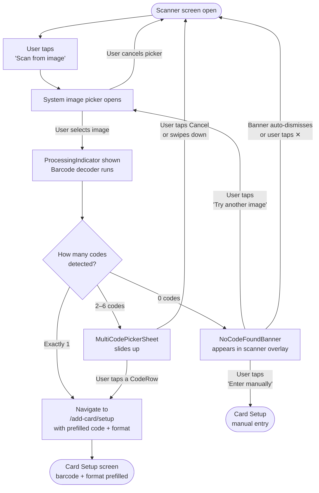

# UX Design — Story 2.9: Scan Cards from Image or Screenshot

**Author:** Sally (UX Designer)
**Date:** 2026-05-03
**Story:** 2.9 — Scan Cards from Image or Screenshot
**Status:** Draft — awaiting developer review

---

## 1. Design Intent

Picture Marco at the checkout. He scanned his physical loyalty card a year ago, but three months ago he switched phones and never rescanned it. The cashier is waiting. His card is a photo on his old WhatsApp thread — _a screenshot of a barcode his wife sent him at the supermarket_.

Story 2.9 answers that exact moment. It lets the user grab a barcode from _any_ image in their camera roll — a screenshot, a forwarded photo, a loyalty-card image from an email — and land on the same prefill form they'd get from a live scan. **No new workflow. One new tap. Zero friction upgrade.**

The feature lives inside the existing scanner screen, surfaced as a secondary CTA alongside "Enter card number manually," and routes through the existing `/add-card/setup` screen without any new page in the navigation stack.

---

## 2. Design Decisions

### 2.1 Placement of "Scan from image"

**Decision: Second CTA row in the existing `ScannerOverlay` bottom actions zone.**

**Rationale:**

The scanner screen already has an established "escape hatch" zone at the bottom (`bottomActions`) with one row: "Enter card number manually." Placing "Scan from image" as a second row directly above it is the fastest path to discovery without touching any navigation outside the scanner. The visual language is already defined (icon + label + chevron on dark background). Users scanning the bottom of the screen naturally see both options at once and pick the right one.

**Rejected alternatives:**

- _Button inside the viewfinder area:_ Would clutter the scan zone and compete with the primary camera action. Increases accidental taps.
- _CardTypeSelectionScreen:_ Too early in the flow — the user hasn't yet confirmed they want to use the scanner. Also not consistent with where all other scan-entry options live.
- _Image picker icon next to the back button:_ Icon-only placement is not discoverable enough for a power feature that requires deliberate choice.

**Layout in `bottomActions`:**

```
┌────────────────────────────────────────────┐
│  ░░░░░░░  full-bleed camera  ░░░░░░░░░░░  │
│                                            │
│         [ viewfinder corners ]             │
│      "Point camera at barcode"             │
│                                            │
│  ────────────────────────────────────────  │
│  🖼  Scan from image               ›       │  ← NEW (imageEntryRow)
│  ────────────────────────────────────────  │
│  ⌨  Enter card number manually     ›       │  ← existing (manualEntryRow)
│  ────────────────────────────────────────  │
│          (bottom safe area)                │
└────────────────────────────────────────────┘
```

A 1px `theme.border` (rgba white at 20% opacity on dark background) separator sits between the two rows. Single tap on "Scan from image" → immediate system image picker launch, no intermediate sheet.

---

### 2.2 Image Source Picker

**Decision: Go straight to the native system picker (no custom pre-picker sheet).**

**Rationale:** iOS's photo library picker and Android's media picker are native, accessible, privacy-controlled, and instantly recognizable to every user. Adding a custom intermediate "choose source" sheet would add one tap with no user benefit — our "Zero-Confirmation Policy" applies here. Call `expo-image-picker` with `MediaTypeOptions.Images`, `quality: 0.9`, and `allowsEditing: false`. No cropping or editing UI.

**Camera Roll only.** Do not offer the camera as a source from this entry point — the live camera is already the primary scanner mode above. Offering it again would be confusing.

---

### 2.3 Multi-Code Selection (AC5)

**Decision: Inline bottom sheet (non-modal, swipe-dismissible) with a compact list of code rows.**

When the processed image returns 2–6 barcodes, a `MultiCodePickerSheet` slides up from the bottom of the scanner screen. It is:

- **Non-modal:** The camera background remains visible behind a dim scrim (`rgba(0,0,0,0.5)`), reinforcing context.
- **Speed-first:** Each row shows the barcode format label + a truncated code preview. One tap resolves the choice and immediately navigates to `/add-card/setup`.
- **Swipe-dismissible:** A drag handle at the top signals swipeability. Drag down or tap the "Cancel" link to dismiss without action.

**Maximum display:** 6 rows (covers virtually all real-world loyalty+QR code images). If more than 6 codes are found, show 6 rows with a footnote `"Showing first 6 codes"` — pathological edge case, does not warrant UI complexity.

**Sheet anatomy:**

```
┌──────────────────────────────────────────┐
│              ——  (drag handle)           │
│                                          │
│  Multiple barcodes found                 │  ← title (headline weight)
│  Tap the one that matches your card      │  ← subtitle (footnote, textSecondary)
│                                          │
│  ┌──────────────────────────────────┐    │
│  │  [icon]  EAN-13 · 8001111234567  │    │  ← CodeRow
│  ├──────────────────────────────────┤    │
│  │  [icon]  QR Code · https://…     │    │  ← CodeRow (URL truncated)
│  ├──────────────────────────────────┤    │
│  │  [icon]  Code 128 · AB1234500    │    │  ← CodeRow
│  └──────────────────────────────────┘    │
│                                          │
│             Cancel                       │  ← text-only link (destructive)
│         (bottom safe area)               │
└──────────────────────────────────────────┘
```

---

### 2.4 No-Code-Found Error State (AC6)

**Decision: Transient inline error banner inside the scanner overlay — no modal, no separate screen.**

When image processing completes with zero readable codes, the system image picker dismisses and the scanner screen resurfaces with a **fixed-position error banner** positioned between the viewfinder and the bottom actions. The banner auto-dismisses after 5 seconds or is closed by a tap. The camera remains running in the background throughout.

**Banner anatomy:**

```
┌────────────────────────────────────────────┐
│                                            │
│         [ viewfinder corners ]             │
│                                            │
│  ┌──────────────────────────────────────┐  │
│  │  ⚠  No barcode found in this image  │  │  ← error banner
│  │                                      │  │
│  │  [Try another image]  [Enter manua…] │  │  ← 2 ghost CTAs
│  └──────────────────────────────────────┘  │
│                                            │
│  🖼  Scan from image               ›       │
│  ⌨  Enter card number manually     ›       │
└────────────────────────────────────────────┘
```

**Rationale:** The user does not leave the scanner screen. The error is localised, non-blocking, and offers the two most likely recovery actions inline. This matches the pattern already used by `ScannerOverlay` for camera permission errors: offer a retry and a manual-entry escape hatch.

---

### 2.5 Accessibility

See §6 for the full accessibility spec table. Summary of key decisions:

- Every new touchable has a descriptive `accessibilityLabel` and explicit `accessibilityRole="button"`.
- `CodeRow` items additionally carry `accessibilityValue` with both the format and full untruncated code so screen readers read the complete value.
- The `MultiCodePickerSheet` drag handle is marked `accessibilityRole="adjustable"` with `accessibilityHint="Swipe down to dismiss"`.
- Error banner is announced via `accessibilityLiveRegion="polite"` so VoiceOver/TalkBack reads it without interrupting in-progress navigation.

---

## 3. Screen Inventory

| #   | Screen / State                                                 | New?          | Parent Component                | Trigger                                    |
| --- | -------------------------------------------------------------- | ------------- | ------------------------------- | ------------------------------------------ |
| S1  | **Scanner overlay — default** (with new "Scan from image" row) | Modified      | `ScannerOverlay`                | Always visible when scanner is open        |
| S2  | **System image picker**                                        | Existing (OS) | `expo-image-picker`             | Tap "Scan from image"                      |
| S3  | **Processing indicator**                                       | New           | `ScannerOverlay` inline overlay | Image selected, analysis in progress       |
| S4  | **Multi-code picker sheet**                                    | New           | `MultiCodePickerSheet`          | Image has 2–6 readable codes               |
| S5  | **No-code-found error banner**                                 | New           | `ScannerOverlay`                | Image has 0 readable codes                 |
| S6  | **Card setup screen** (prefilled)                              | Existing      | `/add-card/setup`               | Single code detected OR user picks from S4 |

---

## 4. Component Spec

### 4.1 `ScannerOverlay` — modified props

```typescript
interface ScannerOverlayProps {
  onScan: (result: ScanResult) => void;
  onManualEntry: () => void;
  onBack: () => void;
  onImageScan?: () => void; // NEW — undefined = row hidden
  brandPill?: React.ReactNode;
  testID?: string;
}
```

When `onImageScan` is provided, the `bottomActions` zone renders two rows separated by a divider.

**Updated `bottomActions` layout:**

| Element              | Style                                                                                                                            |
| -------------------- | -------------------------------------------------------------------------------------------------------------------------------- |
| Image entry row      | Same as `manualEntryRow`: `flexDirection: 'row'`, `height: TOUCH_TARGET.min (44)`, white text, icon left + label + chevron right |
| Divider between rows | `height: StyleSheet.hairlineWidth`, `backgroundColor: 'rgba(255,255,255,0.2)'`                                                   |
| Manual entry row     | Unchanged                                                                                                                        |

**No vertical spacing change** — the two rows stack flush with the hairline divider. Total height increase to the `bottomActions` zone: `44 + hairline` ≈ 45px.

---

### 4.2 `ScanFromImageRow` (inline sub-component of `ScannerOverlay`)

Follows the same `manualEntryRow` visual pattern exactly.

| Property             | Value                                                    |
| -------------------- | -------------------------------------------------------- |
| Icon                 | `MaterialIcons "image"` size 24, color `#FFFFFF`         |
| Label                | `"Scan from image"`                                      |
| Trailing icon        | `MaterialIcons "chevron-right"` size 24, color `#FFFFFF` |
| Typography           | `TYPOGRAPHY.subheadline` (15/20, weight 400)             |
| Color                | `#FFFFFF`                                                |
| Touch target         | `height: TOUCH_TARGET.min` (44px)                        |
| `testID`             | `"scan-from-image-row"`                                  |
| `accessibilityLabel` | `"Scan a barcode from a photo or screenshot"`            |
| `accessibilityRole`  | `"button"`                                               |

---

### 4.3 `ProcessingIndicator` (inline overlay, new)

Shown while `expo-image-picker`'s result is being passed to the barcode decoder. Overlays the scanner screen without blocking the OS picker dismissal animation.

| Property             | Value                                                                                              |
| -------------------- | -------------------------------------------------------------------------------------------------- |
| Container            | `position: 'absolute'`, centered horizontally, positioned at `viewfinderContainer` vertical center |
| Background           | `borderRadius: 12`, `backgroundColor: theme.surface` with `opacity: 0.92`                          |
| Padding              | `SPACING.md` (16px) all sides                                                                      |
| Content              | `ActivityIndicator` (platform default) + `Text "Scanning image…"`                                  |
| Text style           | `TYPOGRAPHY.footnote` (13/18), color `textSecondary`                                               |
| Duration             | Visible until decoder resolves; minimum display 300ms to prevent flicker                           |
| `testID`             | `"image-processing-indicator"`                                                                     |
| `accessibilityLabel` | `"Scanning image for barcode"`                                                                     |
| `accessibilityRole`  | `"progressbar"`                                                                                    |

---

### 4.4 `MultiCodePickerSheet` (new component)

A controlled bottom sheet that presents 2–6 detected barcodes for the user to choose from.

**Props:**

```typescript
interface MultiCodePickerSheetProps {
  visible: boolean;
  codes: Array<{ value: string; format: string }>;
  onSelect: (code: { value: string; format: string }) => void;
  onDismiss: () => void;
  testID?: string;
}
```

**Layout spec:**

| Element         | Spec                                                                                                                                                                                    |
| --------------- | --------------------------------------------------------------------------------------------------------------------------------------------------------------------------------------- |
| **Container**   | `position: 'absolute'`, `bottom: 0`, `left: 0`, `right: 0`. `borderTopLeftRadius: 20`, `borderTopRightRadius: 20`. `backgroundColor: theme.surface`.                                    |
| **Scrim**       | `StyleSheet.absoluteFill`, `backgroundColor: 'rgba(0,0,0,0.5)'`. Tap outside → `onDismiss`.                                                                                             |
| **Drag handle** | Centered bar: `width: 36`, `height: 4`, `borderRadius: 2`, `backgroundColor: theme.border`. `marginTop: SPACING.sm` (8), `marginBottom: SPACING.md` (16).                               |
| **Title**       | `"Multiple barcodes found"` — `TYPOGRAPHY.headline` (17/22, weight 600), `color: theme.textPrimary`. `paddingHorizontal: SPACING.md`.                                                   |
| **Subtitle**    | `"Tap the one that matches your loyalty card"` — `TYPOGRAPHY.footnote` (13/18, weight 400), `color: theme.textSecondary`. `paddingHorizontal: SPACING.md`, `marginTop: SPACING.xs` (4). |
| **Code list**   | `FlatList` with `scrollEnabled` (max 6 items). `marginTop: SPACING.md`.                                                                                                                 |
| **Cancel link** | Text-only button: `"Cancel"`. `TYPOGRAPHY.callout` (16/21), `color: theme.error`. Centered. `paddingVertical: SPACING.md`. `paddingBottom: max(insets.bottom, SPACING.md)`.             |

**`CodeRow` spec (each list item):**

| Element              | Spec                                                                                                                                                                                                                    |
| -------------------- | ----------------------------------------------------------------------------------------------------------------------------------------------------------------------------------------------------------------------- |
| Container            | `flexDirection: 'row'`, `alignItems: 'center'`, `height: 56`, `paddingHorizontal: SPACING.md`.                                                                                                                          |
| Left icon            | `MaterialIcons` — `"qr-code-2"` for QR/DataMatrix, `"barcode"` (or `"view-week"` as fallback) for linear codes. Size 28. `color: theme.primary`.                                                                        |
| Labels (column)      | Top: format name (e.g., `"EAN-13"`) in `TYPOGRAPHY.footnote` (13/18), `color: theme.textSecondary`. Bottom: code value in `TYPOGRAPHY.subheadline` (15/20), `color: theme.textPrimary`. Truncated to 28 chars with `…`. |
| Trailing             | `MaterialIcons "chevron-right"` size 20, `color: theme.textTertiary`.                                                                                                                                                   |
| Divider              | `StyleSheet.hairlineWidth` bottom border, `color: theme.border`.                                                                                                                                                        |
| Touch feedback       | `onPressIn` → `backgroundColor: theme.backgroundSubtle`.                                                                                                                                                                |
| `testID`             | `"code-row-{index}"` (e.g., `"code-row-0"`)                                                                                                                                                                             |
| `accessibilityLabel` | `"{format}, code {full untruncated value}"` (e.g., `"EAN-13, code 8001111234567"`)                                                                                                                                      |
| `accessibilityRole`  | `"button"`                                                                                                                                                                                                              |

**Format display names:**

| Raw format string | Display label |
| ----------------- | ------------- |
| `ean13`           | EAN-13        |
| `ean8`            | EAN-8         |
| `code128`         | Code 128      |
| `code39`          | Code 39       |
| `qr`              | QR Code       |
| `upc_a`           | UPC-A         |
| `datamatrix`      | Data Matrix   |
| _(unknown)_       | Barcode       |

---

### 4.5 `NoCodeFoundBanner` (new component, inline in `ScannerOverlay`)

A non-blocking error notice shown inside the scanner screen.

| Property                      | Value                                                                                                                                                                                                  |
| ----------------------------- | ------------------------------------------------------------------------------------------------------------------------------------------------------------------------------------------------------ |
| **Container**                 | `position: 'absolute'`. Sits between viewfinder bottom and `bottomActions` top. `marginHorizontal: SPACING.md` (16). `borderRadius: 12`. `backgroundColor: 'rgba(0,0,0,0.80)'`. `padding: SPACING.md`. |
| **Icon**                      | `MaterialIcons "warning-amber"` size 20, `color: DARK_THEME.warning` (`#F59E0B`).                                                                                                                      |
| **Message**                   | `"No barcode found in this image"` — `TYPOGRAPHY.subheadline` (15/20), `color: '#FFFFFF'`. Left of close icon.                                                                                         |
| **Close icon**                | `MaterialIcons "close"` size 18, `color: 'rgba(255,255,255,0.6)'`. Tap → dismiss. Top-right corner.                                                                                                    |
| **Action row**                | Two ghost links below message text: `"Try another image"` (left) and `"Enter manually"` (right). `TYPOGRAPHY.footnote` (13/18), `color: DARK_THEME.primary` (`#4DA3FF`). `marginTop: SPACING.sm`.      |
| **Auto-dismiss**              | After 5 000ms if user does not interact.                                                                                                                                                               |
| **Animation**                 | Slide in from bottom + fade in (150ms). Slide out + fade out (150ms) on dismiss.                                                                                                                       |
| **`accessibilityLiveRegion`** | `"polite"` on the container `View`.                                                                                                                                                                    |
| `testID`                      | `"no-code-found-banner"`                                                                                                                                                                               |
| `accessibilityLabel`          | `"No barcode found in this image"`                                                                                                                                                                     |

**Action link spec:**

| Element             | `testID`                | `accessibilityLabel`               | `accessibilityRole` |
| ------------------- | ----------------------- | ---------------------------------- | ------------------- |
| "Try another image" | `"banner-retry-image"`  | `"Try scanning a different image"` | `"button"`          |
| "Enter manually"    | `"banner-manual-entry"` | `"Enter the card number manually"` | `"button"`          |

---

## 5. Interaction Flow



---

## 6. Accessibility Spec

| Element                    | `testID`                     | `accessibilityLabel`                          | `accessibilityRole` | Notes                                      |
| -------------------------- | ---------------------------- | --------------------------------------------- | ------------------- | ------------------------------------------ |
| Scan from image row        | `scan-from-image-row`        | `"Scan a barcode from a photo or screenshot"` | `button`            | In `ScannerOverlay` bottom zone            |
| Processing indicator       | `image-processing-indicator` | `"Scanning image for barcode"`                | `progressbar`       | Shown during decode                        |
| MultiCodePickerSheet scrim | `multi-code-scrim`           | `"Dismiss barcode picker"`                    | `button`            | Invisible full-screen tap area             |
| Drag handle                | `multi-code-drag-handle`     | `"Drag down to dismiss"`                      | `adjustable`        | `accessibilityHint: "Swipe down to close"` |
| Sheet title                | —                            | _(not interactive)_                           | `header`            | Announces sheet context to screen readers  |
| Code row 0–5               | `code-row-{n}`               | `"{format}, code {full value}"`               | `button`            | Full untruncated code in label             |
| Cancel (sheet)             | `multi-code-cancel`          | `"Cancel, dismiss barcode picker"`            | `button`            | —                                          |
| No-code banner container   | `no-code-found-banner`       | `"No barcode found in this image"`            | _(View)_            | `accessibilityLiveRegion="polite"`         |
| Banner close icon          | `banner-close`               | `"Dismiss error message"`                     | `button`            | —                                          |
| "Try another image" link   | `banner-retry-image`         | `"Try scanning a different image"`            | `button`            | —                                          |
| "Enter manually" link      | `banner-manual-entry`        | `"Enter the card number manually"`            | `button`            | —                                          |

---

## 7. Copy — All User-Visible Strings

| ID                          | Surface                       | String                                         |
| --------------------------- | ----------------------------- | ---------------------------------------------- |
| `copy.image_row_label`      | Scanner bottom CTA            | `"Scan from image"`                            |
| `copy.processing_label`     | Processing indicator          | `"Scanning image…"`                            |
| `copy.multi_sheet_title`    | MultiCodePickerSheet title    | `"Multiple barcodes found"`                    |
| `copy.multi_sheet_subtitle` | MultiCodePickerSheet subtitle | `"Tap the one that matches your loyalty card"` |
| `copy.multi_sheet_cancel`   | Sheet cancel link             | `"Cancel"`                                     |
| `copy.no_code_message`      | NoCodeFoundBanner message     | `"No barcode found in this image"`             |
| `copy.no_code_retry`        | NoCodeFoundBanner action 1    | `"Try another image"`                          |
| `copy.no_code_manual`       | NoCodeFoundBanner action 2    | `"Enter manually"`                             |
| `copy.multi_sheet_overflow` | Footnote when > 6 codes       | `"Showing first 6 barcodes found"`             |

---

## 8. Theme Token Mapping

All new components use the same tokens as the existing scanner and shared components. No new tokens are introduced.

| Token                    | Value (Light) | Value (Dark) | Used in                                         |
| ------------------------ | ------------- | ------------ | ----------------------------------------------- |
| `theme.surface`          | `#FFFFFF`     | `#1C1C1E`    | MultiCodePickerSheet background                 |
| `theme.backgroundSubtle` | `#F5F5F5`     | `#0A0A0A`    | CodeRow pressed state                           |
| `theme.textPrimary`      | `#1F1F24`     | `#F5F5F7`    | Code value label                                |
| `theme.textSecondary`    | `#66666B`     | `#D9D9DE`    | Format label, sheet subtitle                    |
| `theme.textTertiary`     | `#8F8F94`     | `#99999E`    | Trailing chevron                                |
| `theme.primary`          | `#1A73E8`     | `#4DA3FF`    | Code row icon, banner action links              |
| `theme.border`           | `#E5E5EB`     | `#38383A`    | CodeRow divider, drag handle                    |
| `theme.error`            | `#DC2626`     | `#F87171`    | Sheet cancel link                               |
| `theme.warning`          | `#D97706`     | `#F59E0B`    | NoCodeFoundBanner warning icon                  |
| `#FFFFFF` (hardcoded)    | —             | —            | Scanner overlay text (always on dark camera bg) |
| `rgba(0,0,0,0.50)`       | —             | —            | Sheet scrim                                     |
| `rgba(0,0,0,0.80)`       | —             | —            | NoCodeFoundBanner backdrop                      |

---

## 9. Open Questions & Developer Notes

The following items require clarification or implementation-time decisions. Tagging for **Amelia (dev)** to review.

### OQ-1 — Barcode decoding library for static images

The existing `useBarcodeScanner` hook is wired to `expo-camera`'s live `onBarcodeScanned` callback. Static image decoding requires a different API surface. Options:

- **`expo-barcode-scanner` (legacy)** — has a `scanFromURLAsync` utility, but the package is deprecated as of SDK 51.
- **`@bwip-js` (already in the project)** — encoder only; cannot decode.
- **`zxing-wasm`** — pure-JS ZXing port, works in React Native via a Worker or direct WASM call; supports all required formats including leading-zero preservation.
- **`expo-image` + native Vision/ML Kit barcode detection** — requires a new native module or an EAS plugin.

**Recommendation from UX:** The choice is Amelia's. From the UX side, the decoder must preserve leading zeros exactly (AC3) — confirm that the chosen library returns raw string values without numeric coercion.

### OQ-2 — Maximum image resolution / memory

`expo-image-picker` can return images up to the device's native camera resolution. Very large images (12MP+) may cause OOM in the JS thread during decoding. Amelia should add a `maxWidth: 2048` / `maxHeight: 2048` resize option to the `launchImageLibraryAsync` call before passing to the decoder.

### OQ-3 — `MultiCodePickerSheet` animation library

The spec calls for a slide-up bottom sheet. The project already uses `react-native-reanimated`. The dev can implement the sheet using `reanimated`'s `useAnimatedStyle` + `withTiming` (consistent with `ScanLine`) or use a lightweight sheet library already present. Confirm no new dependency is needed before adding one.

### OQ-4 — Screenshot classification (nice-to-have, Post-MVP)

Some screenshots contain marketing QR codes (social media links, promo URLs) alongside the actual loyalty barcode. The `MultiCodePickerSheet` currently has no heuristic to deprioritize URL-type QR codes. A Post-MVP enhancement could sort `CodeRow` items by format priority (EAN/Code128 before QR URLs) to reduce wrong selections.

### OQ-5 — Android media permissions

On Android 12 and below, `READ_EXTERNAL_STORAGE` is required. On Android 13+, `READ_MEDIA_IMAGES` is used instead. `expo-image-picker` handles this automatically, but the `app.json` plugin config must declare the correct permission. Confirm the existing `expo-image-picker` plugin entry (if any) covers this.

---

## 10. Success Metrics

| Metric                                                       | Target                                       | Measurement                                          |
| ------------------------------------------------------------ | -------------------------------------------- | ---------------------------------------------------- |
| Image-to-prefill success rate                                | ≥ 85% of selected images with a real barcode | Analytics event `image_scan_success`                 |
| Time from "Scan from image" tap to `/add-card/setup` prefill | ≤ 3 seconds on mid-range device              | Performance trace                                    |
| Multi-code picker abandon rate                               | < 20%                                        | `multi_code_dismissed` vs `multi_code_selected`      |
| No-code fallback → manual entry conversion                   | > 40% (better than abandonment)              | Funnel from `no_code_shown` to `manual_entry_opened` |
